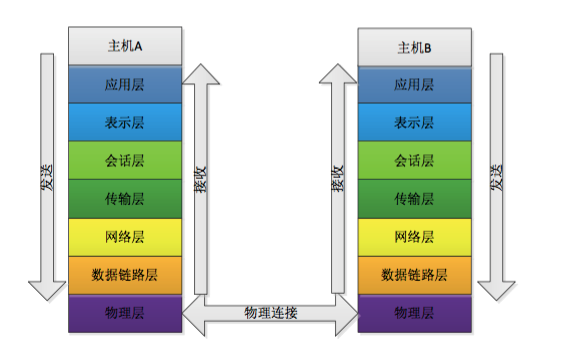
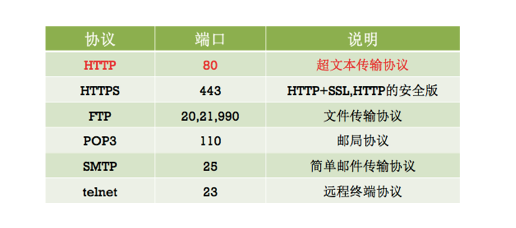

#OSI
##1.OSI模型
        OSI模型（Open System Interconnection model）是一个有国际标准化组织提出的概念
    模型，试图供一个使各种不同的计算机和网络在世界范围内实现互联的标准框架。它将计算
    机网络体系结构划分为七层，每层都可以供抽象良好的接口。料及OSI模型有助有理解实际
    上互联网络的工业标准--TCP/IP协议。
##2.OSI中的七大模型
        ① 物理层：
            物理层负责最后将信息编码成电流脉冲或其他信号用于网上传输；
            eg：RJ45等奖数据转化成0和1；
        ② 数据链路层：
            数据链路层通过物理链路供数据传输。不同的数据链路层定义了不同的网络和协议
        特征，其中包括物理编址、网络拓扑结构、错误校验、数据帧序列以及流控；
            可以简单理解为：规定了0和1的分包形式，确定了网络数据包的形式；
        ③ 网络层：
            网络层负责在源和终点之间建立连接；
            可以理解为，此处需要计算机的位置，怎么确定？IPv4，IPv6；
        ④ 传输层：
            传输层想高层提供可靠的端到端的网络数据流服务。
            可以理解为：每个应用程序斗湖在网卡注册一个端口号，该层就是端口到端口的通行！
        常用的（TCP/IP）协议；
        ⑤ 会话层：
            会话层建立、管理和终止表示层与实体之间的通信回话；
            建立一个连接（自动的手机信息、自动的网络寻址）；
        ⑥ 表示层：
            表示层供多种功能用于应用层数据编码和转化，以确保以一个系统应用层发送的消息
        可以被另一个系统应用层识别；
            可以理解为：解决不同系统之间的通信；
        ⑦ 应用层：
            OSI的引用层洗衣包括文件的传输、访问以及管理协议（FTAM），以及文件虚拟终端协
        议（VIP）和公共管理系统信息（CMIP）等；
            规定数据的传输协议；
        ps：OSI跟层级的关系和通讯时的数据流向如图所示：

##3.应用层协议
        常见的应用层协议：

